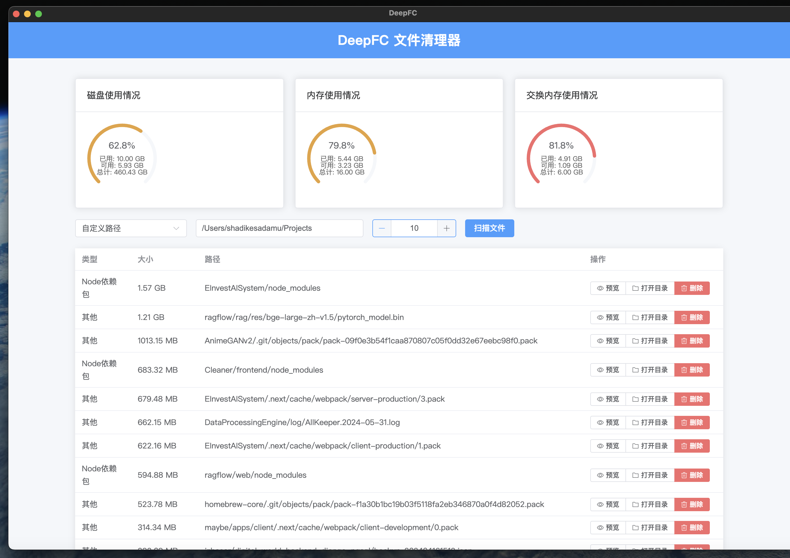
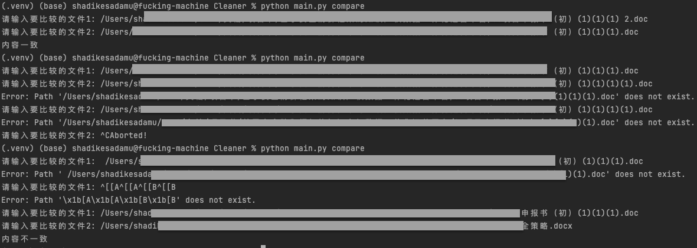

# DeepClean 🧹 深度扫描-文件清理工具

基于`Electron`+`Vue3`+`Vite`+`FastAPI` 开发的跨平台深度文件扫描清理工具.


## 核心功能

* 微信历史消息大附件扫描
* 系统级大文件扫描
* 用户级大文件扫描
* Python和Node等语言开发环境依赖包文件夹扫描

## 开发计划 & TODO

* [ ] 相册最大文件扫描器
    * 其实扫描 [此处](~/Pictures/Photos Library.photoslibrary/) 即可.
* [ ] 微信最大文件扫描器
    * 其实扫描[此处](~/Library/Containers/com.tencent.xinWeChat/Data)即可.
* [ ] 结合到[Immich的python上传脚本](https://immich.app/docs/guides/python-file-upload), 实现先上传到Immich, 然后进行删除
    * 当然是先要给用户一个选择(直接删除/备份再删除本地副本)
* [ ] ~~利用Tkinter先实现简单的可视化界面.~~
* [ ] ~~后期用WPF为Windows系统出一个更完美的UI和使用体验.~~
* [ ] ~~后期使用Swift给MacOS系统出一个更完美的UI和使用体验.~~
* [ ] 得好好研究一下`/Users/shadikesadamu/Library/Caches`缓存目录
* [ ] 可能后期要增加病毒扫描(初衷: 不是增加额外的功能, 而是在文件扫描时发现可疑文件, 就顺便做个警告即可.)

## 使用方法

### 可视化版本

直接从Release中下载,安装即可使用.

### 命令行版本

1. 安装Python环境
   可以用Anaconda 或者 miniConda
2. 安装依赖

```shell
pip install -r requirements.txt
```

3. 运行脚本

```python
Usage: main.py[OPTIONS]
COMMAND[ARGS]...

Options:
--help
Show
this
message and exit.

Commands:
compare
比较两个文件的内容是否一致(有利于, 同内容不同名文件的比较和唯一性确认和重复率计算)
scan
浅扫描(目录级普通扫描)
smart - deep - scan
深度智能扫描(包含微信文件扫描 + MacOS相册扫描)
```

